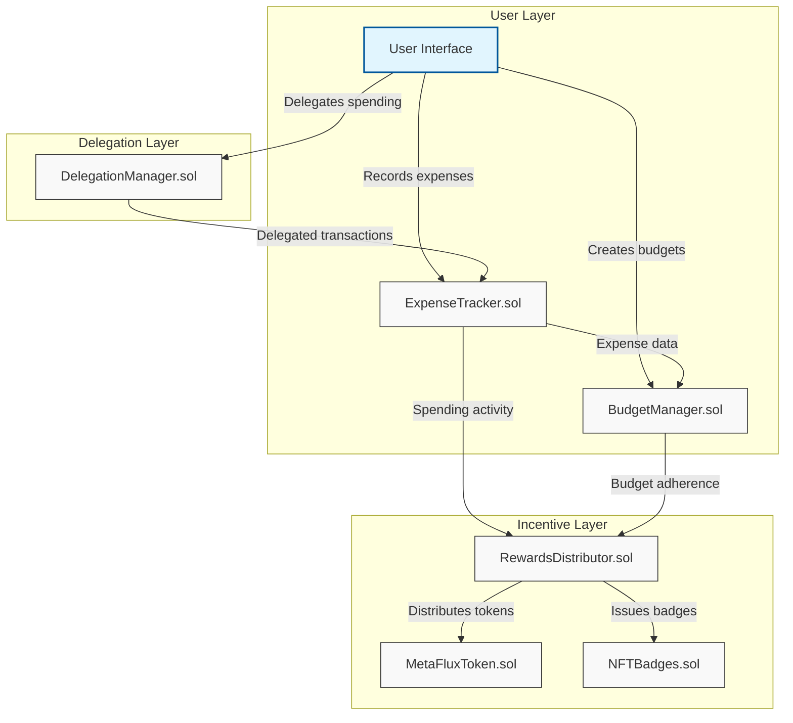

# MetaFlux Finance

MetaFlux is a comprehensive blockchain-based expense management and financial tracking system built on the Pharos blockchain. It provides robust tools for expense tracking, budget management, delegation controls, and rewards.

## Overview

MetaFlux creates a complete financial management ecosystem with several integrated components:

- **ExpenseTracker**: Records and categorizes expenses
- **BudgetManager**: Sets and enforces spending budgets
- **DelegationManager**: Facilitates controlled spending delegation between users
- **RewardsDistributor**: Rewards users for financial achievements
- **MetaFluxToken (MFT)**: ERC-20 token for rewards and potential governance
- **NFTBadges**: ERC-721 tokens representing achievements

## Architecture

MetaFlux follows a modular design with separate contracts for distinct functionality that interact through well-defined interfaces:



The architecture consists of three primary layers:

1. **User Layer**: Direct interaction with ExpenseTracker and BudgetManager for core expense recording and budget management
2. **Delegation Layer**: Controlled spending permissions via DelegationManager, enabling delegation relationships between users
3. **Incentive Layer**: Rewards and achievements via RewardsDistributor, MetaFluxToken, and NFTBadges to encourage positive financial behaviors

Data flows from user interactions through the system layers, with financial activities triggering appropriate rewards and achievements based on predefined criteria.

## Smart Contracts

### ExpenseTracker.sol

Records and categorizes expenses with key features:

- Track expenses by category with descriptions and reimbursement status
- Predefined and customizable expense categories
- Query user expenses by category or in aggregate

```solidity
function recordExpense(
    uint256 amount,
    string calldata category,
    string calldata description,
    bool isReimbursable
) external returns (uint256);
```

### BudgetManager.sol

Sets and enforces spending budgets:

- Create budgets for different expense categories
- Define budget periods (daily, weekly, monthly, quarterly, yearly)
- Monitor spending and get notifications when approaching budget thresholds
- Automatic budget reset at period end

```solidity
function createBudget(
    string calldata category,
    uint256 amount,
    Period period
) external;
```

### DelegationManager.sol

Handles spending delegation between users:

- Delegate spending permissions with customizable limits
- Set expiration times for delegations
- Track and manage delegated spending
- View delegation relationships

```solidity
function createDelegation(
    address delegate,
    uint256 spendLimit,
    uint256 expiryDuration
) external;
```

### RewardsDistributor.sol

Manages achievement-based rewards:

- Track user achievements
- Distribute token rewards
- Award NFT badges for milestones
- View achievement progress

```solidity
function awardAchievement(
    address user,
    uint256 achievementId
) external;
```

### MetaFluxToken.sol

ERC-20 token used for rewards and potential platform governance.

### NFTBadges.sol

ERC-721 tokens representing achievements and milestones:

- Tiered badge system with different rarity levels
- Metadata storage for badge attributes
- Customizable badge properties

## Getting Started

### Prerequisites

- Node.js v14+ and npm
- Hardhat
- MetaMask or other Ethereum wallet

### Installation

1. Clone the repository:

```bash
git clone https://github.com/yourusername/metaflux.git
cd metaflux
```

2. Install dependencies:

```bash
npm install
```

3. Set up environment variables:

```bash
npx hardhat vars set ACCOUNT_PRIVATE_KEY
# Enter your wallet's private key when prompted
```

### Compilation

Compile the smart contracts:

```bash
npx hardhat compile
```

### Testing

Run the test suite:

```bash
npx hardhat test
```

Run tests with gas reporting:

```bash
REPORT_GAS=true npx hardhat test
```

Check test coverage:

```bash
npx hardhat coverage
```

## Test Framework

MetaFlux uses a comprehensive testing framework to ensure all components work correctly individually and together. The tests cover:

### Contract-Specific Tests

Each contract has dedicated tests to verify core functionality:

1. **ExpenseTracker**
   - Initialization with default categories
   - Category management (adding new categories)
   - Expense recording and retrieval
   - Category-based expense filtering

2. **BudgetManager**
   - Budget creation and tracking
   - Expense monitoring against budgets
   - Period-based budget reset functionality
   - Budget threshold notifications (75%, 90%, 100%)

3. **DelegationManager**
   - Delegation creation and tracking
   - Delegation updates and revocation
   - Relationship tracking between admins and delegates
   - Delegated spending limits enforcement

4. **MetaFluxToken**
   - Initialization with correct parameters
   - Role-based minting controls
   - Balance tracking

5. **NFTBadges**
   - Default badge initialization
   - Badge minting and ownership verification
   - Creation of new badge types
   - Badge rarity system

6. **RewardsDistributor**
   - Achievement initialization
   - Awarding achievements to users
   - Reward claiming functionality
   - Achievement milestone tracking

### Integration Tests

Comprehensive tests that verify interactions between multiple contracts:

1. **Complete Expense Flow**
   - Budget creation and expense recording
   - Budget tracking and updating
   - Achievement awarding based on financial activity
   - Reward claiming and token/badge distribution

2. **Delegation Flow**
   - Delegation relationship establishment
   - Delegated expense recording
   - Spend limit tracking and enforcement
   - Integration with the expense tracking system

### Test Helpers

The test suite includes helper utilities for common test operations:

- `setupContracts.ts`: Provides functions to deploy and configure all contracts
- `eventEmitter.ts`: Utilities for monitoring and validating contract events

## Security Features

- OpenZeppelin contracts for standard implementations
- Access control with role-based permissions
- Reentrancy protection for financial operations
- Comprehensive validation checks
- Extensive test coverage of all functionality
